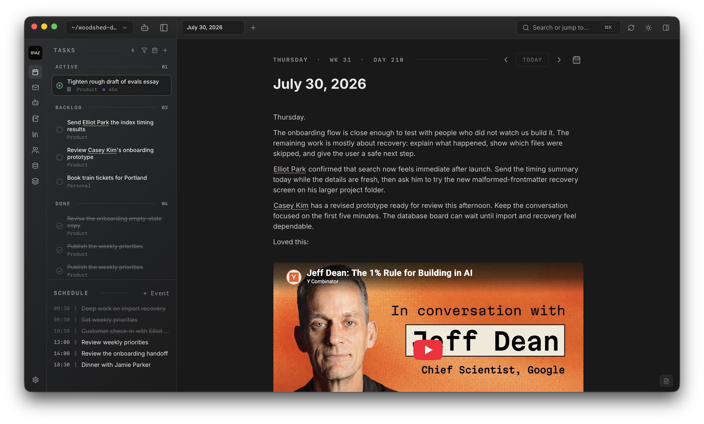

# Woodshed

**Stop rebuilding context every time you switch apps.**

Woodshed is a macOS workspace that connects your calendar, inbox, notes, tasks,
and people. Prepare for a meeting, take notes, capture the follow-up, and later
find the whole trail through the people and topics involved. Your durable records remain ordinary Markdown files on your computer. There is
no Woodshed account or hosted backend.



*Cadence keeps the daily note, schedule, and task rail in the same working
view.*

## Who Woodshed is for

Woodshed is for people whose work runs on context: founders, managers,
consultants, researchers, and anyone who is tired of reconstructing a
relationship or project across separate tools.

It is a single-player, local-first workspace rather than a hosted team wiki.
macOS is the first supported platform.

## Why Woodshed

Most productivity tools split work into separate databases. The meeting is in
one app, its notes in another, the follow-up in a third, and the relevant person
somewhere else.

Woodshed treats those records as one trail of context. A person can connect to
an event, task, email, note, area, or Agent conversation through the same local
graph.

- **Files over app.** Markdown is the source of truth; Woodshed is a lens.
- **Local by default.** There is no account system, analytics, or telemetry.
- **One vault, many surfaces.** Records share tags, links, search, and context.
- **Explicit integrations.** Network actions run only after user configuration
  and invocation.
- **Narrow privilege.** The webview uses scoped Rust commands instead of general
  shell or filesystem permissions.

## Status and access

Woodshed is in active development. The public repository is a source preview;
the current release does not include a downloadable application. To try an
early build, [request pilot access](mailto:hello@woodshed.md?subject=Woodshed%20pilot%20access),
or [build Woodshed from source](#development).

When signed macOS builds are available, they will be published through
[GitHub Releases](https://github.com/indiethinkers/woodshed/releases). Maintainer
packaging instructions live in
[`docs/RELEASING.md`](docs/RELEASING.md).

## Features

### Connected surfaces

| Surface | What it does |
|---|---|
| **Cadence** | Combines the daily journal, calendar schedule, and task rail |
| **Mail** | Unifies configured Gmail inboxes, searchable sent/archive folders, drafts, and replies |
| **Agent** | Stores AI conversations as vault records and adds page-aware chat |
| **Notebook** | Provides long-form Markdown editing plus folder browsing for adopted files |
| **Resources** | Captures web links, metadata, highlights, and personal notes |
| **People** | Acts as a personal CRM connected to events, notes, mail, and areas |
| **Databases** | Supports resizable structured tables, board views, rows, and generated tag tables |
| **Areas** | Groups related notes, tasks, events, and people around a focus |

### Features across every surface

- **Full-text command palette.** Search navigation, date keywords, and indexed
  vault content from one place.
- **Create from search.** Commands such as `new task`, `new note`, `new person`,
  and `new table` create records without leaving the palette.
- **Tags and tag tables.** Frontmatter and inline `#tags` produce indexed,
  queryable views.
- **Wikilinks and backlinks.** `[[Person or record]]` links connect the vault and
  surface reverse references.
- **Tabs and reference sidebar.** Keep several records open or pin supporting
  context beside the current page.
- **External-edit reactivity.** Changes made in another editor appear in the
  running app after watcher invalidation and re-indexing.
- **Tiptap editing.** Notes and record bodies support Markdown, slash commands,
  images, YouTube/X embeds, and inline wikilinks.
- **Recoverable deletion.** Supported destructive actions move records into the
  vault's `.woodshed/trash/` tree.

## How Woodshed stores data

### The selected vault

The user chooses a vault directory during onboarding. Woodshed stores that
selection in app configuration; the vault can live anywhere the app can access.

The repository and vault are independent. Neither path is derived from the
other.

Onboarding can also adopt an existing Markdown folder. Woodshed leaves those
files in place and shows them in Notebook using their current folder hierarchy.
Its typed records live under a visible `<vault_root>/woodshed/` child, while
recoverable revisions and trash remain under `<vault_root>/.woodshed/`.

```text
<vault_root>/
├── cadence/       Daily journals
├── events/        Events and meeting notes
├── tasks/         First-class tasks
├── notebook/      Long-form notes
├── people/        Personal CRM records
├── resources/     Saved links and highlights
├── tables/        Database schemas and rows
├── areas/         Areas of focus
├── inbox/         Gmail inbox records
├── sent/          Sent messages
├── archive/       Archived messages
├── drafts/        Mail drafts
├── agent/         Agent conversation transcripts
├── attachments/   User and mail attachments
└── .woodshed/     Trash and record revisions
```

Vaults created by older builds may retain retired `sweep/` Markdown records.
Woodshed no longer scaffolds or uses that directory, and upgrades deliberately
leave those files untouched for manual inspection or removal.

Most records pair structured frontmatter with a freeform Markdown body:

```markdown
---
type: task
id: t_ship-pricing-rewrite-01J...
content: Ship pricing rewrite
status: in-progress
area: woodshed
created: 2026-07-26T09:30:00-07:00
scheduled: 2026-07-26
tags: [task]
time_spent_seconds: 1234
---
```

Schemas live in `src-tauri/src/parsers/`. Domain renderers preserve the file
format when a record has specialized fields or body semantics.

### Derived and platform state

Woodshed keeps rebuildable state under Tauri's platform-specific application
data directory:

| Path | Purpose |
|---|---|
| `<app_data_dir>/config.json` | Vault selection and non-secret preferences |
| `<app_data_dir>/secrets.json` | Owner-only Gmail and custom Hermes secrets |
| `<app_data_dir>/index.db` | SQLite FTS5 search and graph indexes |
| `<app_data_dir>/gcal-cache/` | Parsed read-only iCal event caches |
| `<app_data_dir>/agent-runs/` | Durable Agent job status, progress, and results |
| `<app_data_dir>/woodshed.log` | Size-capped diagnostics log |

Deleting the search index or calendar cache does not delete vault records.
`config.json` holds no secrets. Gmail App Passwords and custom Hermes bearer
keys live in `secrets.json`, which is owner-readable only (`0600`) and protected
by operating-system account isolation and full-disk encryption rather than
Keychain prompts. It is never included in logs, diagnostics, exports, or the
vault. Secret iCal URLs remain in the operating-system credential store.

### Writes, watching, and search

Rust commands validate paths and write records atomically. Supported iCloud
locations use a direct-write fallback because rename behavior can be unreliable
across the sync boundary.

Each internal write updates the search index synchronously and records a
self-write fingerprint. The watcher filters the echo before notifying React.

External writes follow the other path: the watcher debounces the change,
refreshes the affected index entry, and emits `vault:changed`. TanStack Query
then invalidates the matching data.

## Using Woodshed

### First launch

Onboarding asks for a vault location and profile information. The suggested
location is only a default; choose any appropriate writable directory.

Woodshed can open an existing Markdown folder without moving its files, or
scaffold a new vault with optional sample content. Settings later exposes the
selected path, profile, appearance, integrations, Agent endpoint, and
diagnostics.

### Optional integrations

| Integration | Capability | Secret storage |
|---|---|---|
| Gmail | Multi-account IMAP inbox and SMTP send/reply | Owner-only app-data file |
| Google Calendar | Read-only iCal subscription and local event cache | OS credential store |
| Hermes-compatible endpoint | Agent chat and confirmed actions | Local profile discovery, or owner-only app-data file |

Resource capture fetches only a URL submitted by the user. Public fetches reject
private network targets and enforce redirect, time, and response-size limits.

### Keyboard shortcuts

Shortcuts below use macOS notation because macOS is the supported desktop
target. Several handlers also accept Control in frontend-only environments.

#### Navigation and workspace

| Shortcut | Action |
|---|---|
| `⌘K` | Open or close global search and commands |
| Type a letter or digit | Start global search when no editor or dialog is active |
| `⌘T` | Open search in “new tab” mode |
| `⌘1` … `⌘8` | Open Cadence, Mail, Agent, Notebook, Resources, People, Databases, or Areas |
| `⌘[` / `⌘]` | Go back or forward in the active tab |
| `⌘⇧[` / `⌘⇧]` | Select the previous or next tab |
| `⌘W` | Close the active tab; close the window when it is the only tab |
| `⌘⇧W` | Close the window |
| `⌘,` | Open Settings |

#### Panels and context

| Shortcut or gesture | Action |
|---|---|
| `⌘\` | Show or hide the surface list panel |
| `⌘/` | Show or hide the reference sidebar |
| `⌘B` | Open page-aware Agent chat when focus is outside an editor |
| `Shift` + click | Open an internal link in the reference sidebar |
| `Shift` + `⌘` + click | Open an internal link in a new tab |

Inside an editor, `⌘B` remains the normal bold shortcut. Type `/` for the block
menu and `[[` to search wikilink targets.

#### Mail

| Context | Shortcut | Action |
|---|---|---|
| Inbox | `↑` / `↓` | Move the focused thread |
| Inbox | `Enter` | Open the focused thread |
| Inbox | `C` | Compose a message |
| Inbox | `E` | Archive the focused or selected threads |
| Inbox | `A` | Select or clear all visible threads |
| Thread | `J` / `K` or `↓` / `↑` | Move between messages |
| Thread | `R` | Reply inline |
| Thread | `⇧R` | Open the full reply composer |
| Thread | `F` | Forward the thread |
| Thread | `E` | Archive the thread |
| Thread | `Esc` | Return to the inbox |
| Composer | `⌘Enter` | Send |

#### Agent

| Shortcut | Action |
|---|---|
| `⌘N` | Start a new conversation on the Agent surface |
| `Enter` | Focus the Agent composer when focus is outside an interactive control |
| `Esc` | Leave the composer |

## Architecture

### Stack

| Layer | Technology |
|---|---|
| Desktop shell | Tauri 2 and WKWebView |
| Frontend | React 19, Vite, TypeScript, TanStack Router and Query |
| UI and editor | Tailwind, shadcn/ui, Tiptap |
| Backend | Rust commands and domain modules |
| Primary storage | Markdown and YAML frontmatter in the selected vault |
| Derived storage | SQLite FTS5, normalized edges, iCal JSON cache |

The runtime path is deliberately narrow:

```text
route or component
  → TanStack Query hook
  → typed Tauri client
  → scoped Rust command
  → vault file / integration / derived index
  → watcher event and targeted query invalidation
```

The webview cannot browse arbitrary files or execute shell commands. Operations
such as saving an attachment, opening a URL, or changing a record cross an
explicit Rust command boundary.

### Frontend modules

| Path | Responsibility |
|---|---|
| `src/routes/` | File-based TanStack routes and route loaders |
| `src/components/layout/` | Navigation rail, tabs, panels, title bar, providers |
| `src/components/cadence/` | Daily journal, event, and task experiences |
| `src/components/mail/` | Inbox, thread, compose, and account UI |
| `src/components/agent/` | Chat surface, streaming messages, and tools |
| `src/components/notebook/` | Note list and detail experiences |
| `src/components/people/` | Personal CRM list, detail, and avatar flows |
| `src/components/resources/` | Saved-link capture, list, and detail UI |
| `src/components/tables/` | Database views, rows, cells, filters, and calculations |
| `src/components/areas/` | Area list, detail, and cross-record aggregation |
| `src/components/shared/` | Tiptap, command palette, wikilinks, and shared controls |
| `src/lib/hooks/` | TanStack Query reads, mutations, and cache invalidation |
| `src/lib/command-search.ts` | Local commands, date keywords, and result grouping |
| `src/lib/tauri.ts` | Logged frontend boundary for backend invocation |

### Rust modules

| Path | Responsibility |
|---|---|
| `src-tauri/src/commands/` | Tauri command surface grouped by product domain |
| `src-tauri/src/vault/` | Safe path resolution, bounded reads, writes, trash, migrations |
| `src-tauri/src/parsers/` | Markdown and frontmatter schemas |
| `src-tauri/src/index/` | FTS5 search, tags, wikilinks, and backlinks |
| `src-tauri/src/watcher/` | Debounced filesystem events and self-write filtering |
| `src-tauri/src/gmail/` | Gmail IMAP/SMTP clients, parsing, credentials, pooling |
| `src-tauri/src/gcal/` | iCal parsing, filtering, recurrence, and caching |
| `src-tauri/src/agent/` | Agent records, endpoint configuration, and stream protocol |
| `src-tauri/src/network.rs` | Public URL validation and bounded requests |
| `src-tauri/src/email_render.rs` | Sanitized email rendering and remote-image blocking |
| `src-tauri/src/image_cache.rs` | Bounded disk cache for approved remote images |
| `src-tauri/src/state/` | Process-lifetime indexes and caches shared by commands |
| `src-tauri/src/logging.rs` | Persistent rotating diagnostics |

`src-tauri/src/lib.rs` assembles the application, shared state, custom URI
schemes, menu behavior, plugins, and the complete Tauri command handler.

For deeper implementation guidance, read [AGENTS.md](AGENTS.md).

## Development

### Requirements

- macOS with the [Tauri 2 prerequisites](https://v2.tauri.app/start/prerequisites/)
- [Bun](https://bun.sh/) 1.3.13
- Stable Rust with Cargo

### Run the desktop app

From the repository root:

```sh
bun install --frozen-lockfile
bun run tauri:dev
```

`tauri:dev` starts Vite and opens the native application. Use bare
`bun run dev` only for frontend work that does not need Tauri or vault I/O.

Before starting another development session, check for a running
`target/debug/woodshed` process. Reuse the existing native instance when one is
already active.

### Verification

Run focused tests while iterating. The complete local suite is:

```sh
bun run build
bun run lint
bun run typecheck
bun run test
cargo fmt --manifest-path src-tauri/Cargo.toml -- --check
cargo clippy --manifest-path src-tauri/Cargo.toml --all-targets -- -D warnings
cargo test --manifest-path src-tauri/Cargo.toml
bun audit
cargo audit --file src-tauri/Cargo.lock
```

Playwright and `tauri-driver` provide deliberate end-to-end coverage. Native
window inspection remains the default for live UI review.

Optional development integration variables are documented in
[`.env.example`](.env.example). Keep `.env.local`, credentials, and private
vault fixtures out of Git.

## Privacy and security

Woodshed has no account system, analytics, crash reporter, or operated backend.
Configured integrations communicate directly from the desktop app.

Mail and calendar refresh is manual by default. Settings can opt into bounded
foreground polling every 5, 15, 30, or 60 minutes while Woodshed is running.

- Gmail uses IMAP and SMTP, including recent Sent Mail so replies from other
  clients remain visible in local threads. App Passwords are stored in an
  owner-only app-data file that relies on OS account isolation and disk
  encryption.
- Google Calendar uses a read-only secret iCal URL stored by the OS.
- Hermes receives selected content after an explicit Agent action.
  Loopback endpoints authenticate from the matching local Hermes profile; custom
  and remote endpoints use the same owner-only app-data file.
- Opening an HTML email loads remote images through Woodshed's bounded cache.
- Public URL requests reject local and private network destinations.

Generated Agent plans show confirmation before creating records, archiving mail,
or performing other supported mutations.

See the [privacy notice](docs/legal/PRIVACY.md) and
[security model](docs/SECURITY-MODEL.md) for the complete boundaries.

## Contributing

Read [CONTRIBUTING.md](CONTRIBUTING.md) before opening a pull request. Keep
changes focused, add tests for changed behavior, and run the relevant checks.

Report vulnerabilities through the private process in
[SECURITY.md](SECURITY.md), not through public issues.

## License

Licensed under the [Apache License 2.0](LICENSE).
